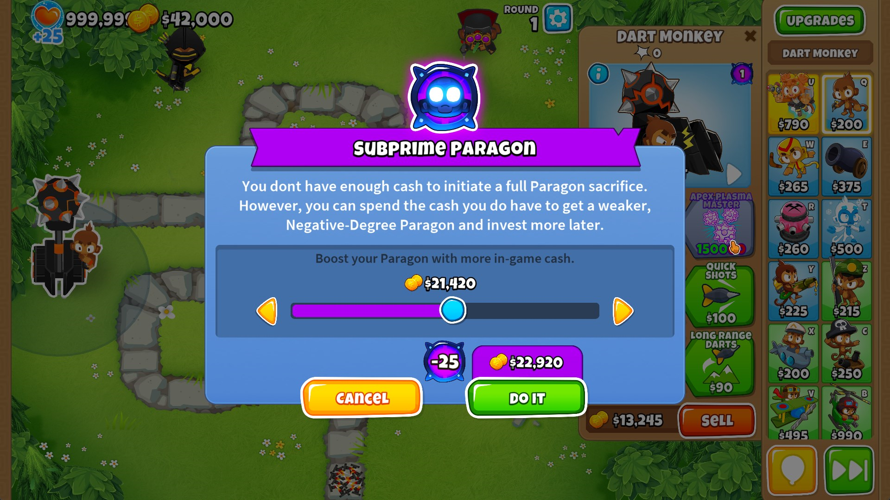
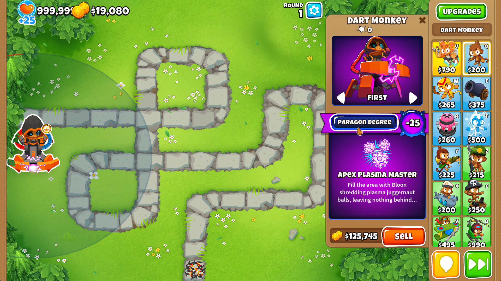
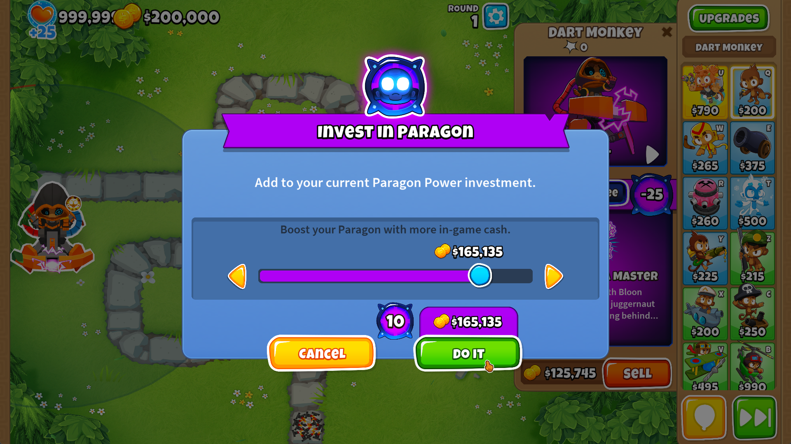
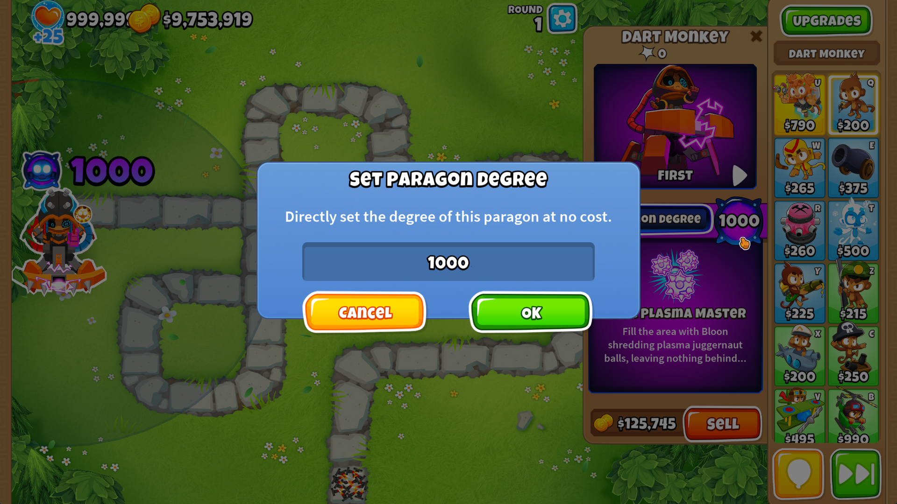

<h1 align="center">

Paragonomics
</h1>

### Adds new ways to change Paragon degrees using cash.

### Note: Degree Indicators in Screenshots comes from [Useful Utilities](https://github.com/doombubbles/useful-utilities#readme)

## Subprime Paragons

If you have less than the amount of money to required to purchase a Paragon upgrade, you can spend less on it to make a
Subprime Paragon that is weakened by having a negative degree.

The goal of this is to make more Paragons be usable in non-freeplay games without tons of farming.

Works by clicking on the Paragon Upgrade that you don't have the cash for (though you have to have at least 1% of the
total cost in cash; that's what the green text on the upgrade cost signifies).

Negative Degree Algorithm Details

The negative degree paragon algorithm is the same as the one for positive degrees except for:

- The flat damage and pierce changes are not included, to prevent those numbers from going to zero
- The percentage based damage and pierce changes apply are applied like attack speed boosts are, also to prevent those
  numbers from going to all the way to zero
    - i.e. -25% pierce means dividing by 125% rather than multiplying by 75%
- The remaining applied changes are scaled by a factor based on how much the paragon upgrade costs in relation to the
  towers
    - e.g. A full Dart Monkey paragon costs ~250k, with ~100k from the tier 5s, making the negative buffs be 2.5% per
      degree instead of 1% per degree

## Paragon Investing

The "Paragon Degree" text is now a button that you can press to invest more money into the
paragon and increase its degree. This is useful for Subprime Paragons to put more money into them and get them out of
the negatives, and also just for normal paragons to increase their power without having to sell/rebuy.

## Set Degrees

If you're in Sandbox mode (or have the "Set Degree Outside Sandbox" Mod Setting turned on),
you can click directly on the Paragon degree number to set it to whatever you want.
If you turn on the No Degree Limit setting, you can set it past the standard 100 limit, as shown below.
Getting too close to the integer overflow limit will lead to undefined behavior.

